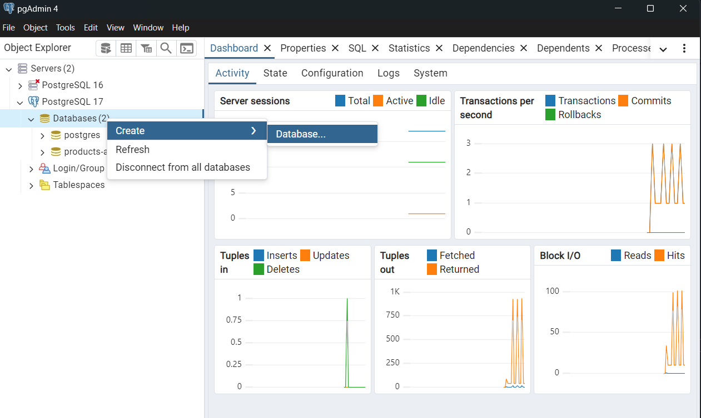
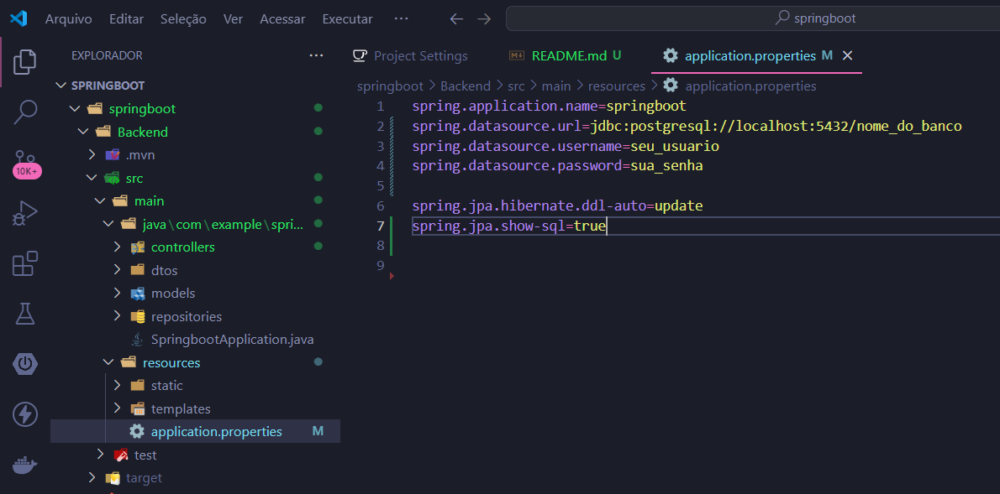
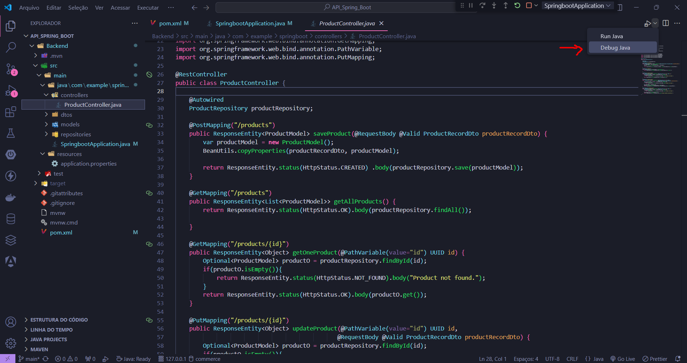

# Técnico: Sistema de Cadastro de Máquinas Virtuais

## Descrição do Projeto

Este projeto é uma **API de gerenciamento de máquinas virtuais** com backend em Java/Spring Boot e frontend em Angular, permitindo criar, atualizar, listar e excluir máquinas virtuais por meio de uma interface web intuitiva.

### Funcionalidades

- **Autenticação de máquinas**:
  - Registro de novas máquinas virtuais.
- **Gerenciamento de máquinas virtuais cadastradas**:
  - Listar máquinas virtuais cadastradas disponíveis.
  - Consultar uma máquina específica através do seu ID.
- **Gerenciamento de cadastro**:
  - Criar e consultar o cadastro das máquinas virtuais.
  - Atualizar o informações do cadastro (exceto o ID, a data e hora de criação do cadastro).
  - Cancelar cadaastro.

## Pré-requisitos


- [Java Development Kit (JDK) 17 ou superior](https://www.oracle.com/java/technologies/javase/jdk17-archive-downloads.html) - Versão do Java utilizada para esse projeto.
- [Maven](https://maven.apache.org/download.cgi) - Para gerenciamento de dependências do Spring Boot
- [PostgreSQL](https://www.postgresql.org/download/) - Para o gerenciamento do banco de dados.
- [Node.js](https://nodejs.org/) 
- [Angular CLI](baixado através do gerenciador npm)
- [VsCode]-Visual Studio Code (IDE opcional, pode-se Eclipse ou IntelliJ IDEA )


- Um gerenciador de pacotes como **npm** ou **yarn**


### 1. Clone o repositório

O código '. code', serve para abrir o diretório no VsCode diretamente pelo terminal.

```bash
git clone https://github.com/LimaThalita/API_Spring_Boot
cd API_Spring_Boot
. code
```

### 2. Configure o banco de dados

Após baixar o PostgreSQL, acesse o cliente PostgreSQL (como pgAdmin ou psql). Depois, inicie uma nova base dados clicando com o botão direito na aba "Databases", seguindo "Create", em seguida "Database". Escolha o nome de sua preferência. Durante a intalação serão exibidas a porta (a padrão é porta 5432) e a senha (definida pelo usuário). Essas informações são te extrema importância, sendo indicado que sejam anotadas e guardadas.



### 3. Configure as credenciais

No arquivo "application.properties" serão determinadas as credenciais do seu banco. 



```bash
spring.datasource.url=jdbc:postgresql://localhost:5432/nome_do_banco
spring.datasource.username=seu_usuario
spring.datasource.password=sua_senha

spring.jpa.hibernate.ddl-auto=update
spring.jpa.show-sql=true
```

### 4.Iniciando o Backend
Pode utilizar o próprio terminal do VsCode.Dessa forma, compile e execute o projeto usando o Maven:
```bash
mvn spring-boot:run
```
Outra opção é prressionar o botão "Debug Java", no canto superior direito da tela do VsCode.


### OBS: 
O backend estará disponível em http://localhost:8080.


### 5. Iniciando o Frontend 

Navegue até o diretório do frontend pelo terminal:

```bash
cd backend
```
Instale as dependências do Angular:

```bash
npm install -g @angular/cli
```
Inicie o servidor de desenvolvimento Angular:
```bash
ng serve
```

### OBS: 
O frontend estará disponível em http://localhost:4200.

### 6. Testando a Aplicação

- Certifique-se de que o backend está em execução no endereço http://localhost:8080.
- Certifique-se de que o frontend está em execução no endereço http://localhost:4200.
- Valide se os dados inseridos na interface estão sendo armazenados corretamente no PostgreSQL.

### 7. Considerações Finais

- Este projeto foi desenvolvido e testado usando o Visual Studio Code como IDE principal.
- Caso tenha problemas na execução, verifique as configurações do banco de dados e a compatibilidade das versões das ferramentas.


